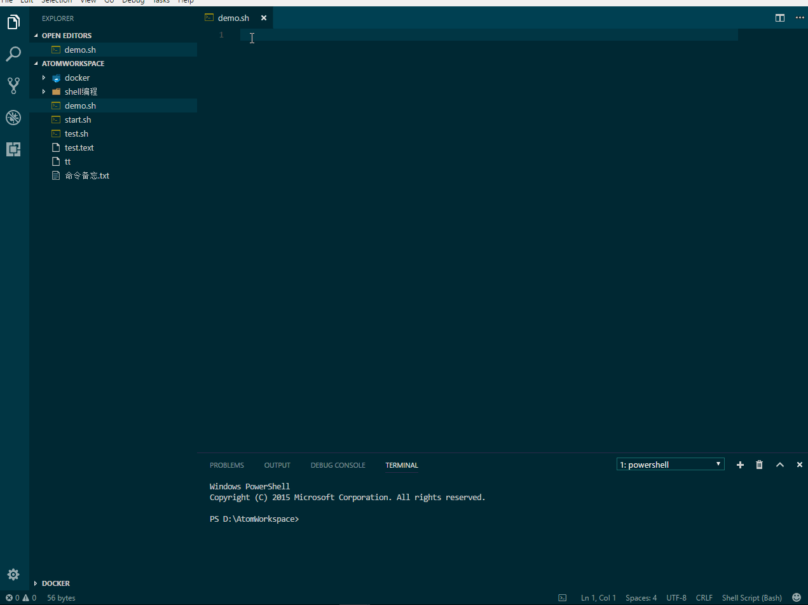

# README

## Visual Studio Code autocomplete-shell
 
This extension adds rich language support for the shell script to VS Code, including:

## How to use?

## Basic code

- if/elif/else
- echo/read
- for/while/until/break
- function
- case expr
- test int/string/file

## Bash variables and functions

An autocomplete for common used bash variables and functions. Docs are from 
[Bash Reference Manual](https://www.gnu.org/software/bash/manual/bash.html)

## Package

- `npm install -g vsce`
- `vsce package`

## How can I report an issue?

The easiest way is to start a git issue, I will attempt to answer ASAP else I hope someone else will answer.

# License

MIT License, refer to license file.

# Source

[Github](https://github.com/trumandu/autocomplete-shell)

# Declaration

This project refers to two other projects:

- Atom Package [autocomplete-bash-builtins](https://github.com/JASONews/autocomplete-bash-builtins)

- [shell-snippets](https://github.com/cdsama/shell-snippets)

Thanks for the owner!

** Enjoy!**
